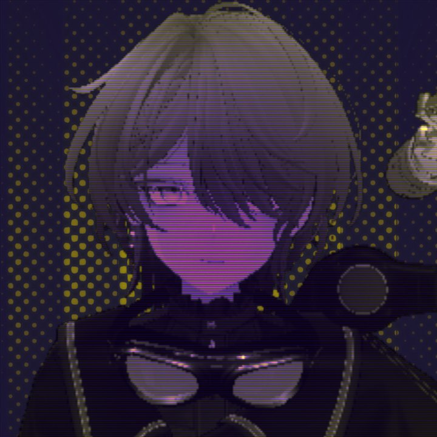

# Vega Lyrae

Mechatronics and computer science student, IT systems practitioner, and independent creator exploring robotics, embodied AI, synthetic voice, and interactive media.

I build in public through development streams, creative experiments, music, and community projects.

[Visit my portfolio and links hub](https://vegalyrae.tech/) · [Projects](https://vegalyrae.tech/projects/) · [About](https://vegalyrae.tech/about/)

## Find me online

[ Twitch](https://twitch.tv/vegalyraebard) ·
[ YouTube](https://youtube.com/@VegaLyrae) ·
[ Discord](https://discord.gg/UPQgsszwZA) ·
[ X](https://x.com/VegaLyraeVT) ·
[ TikTok](https://tiktok.com/@vegalyraevtuber) ·
[ SoundCloud](https://soundcloud.com/vegalyrae) ·
[ GitHub](https://github.com/vegalyraevt) ·
[ Ko-fi](https://ko-fi.com/vegalyrae) ·
[ Throne](https://throne.com/vegalyrae) ·
[ AI VTuber Reddit](https://www.reddit.com/r/ArtificialVTubers/s/LStb0HMwW8)

## Selected work

- **[AuroraChan AI](https://vegalyrae.tech/projects/#aurora)** — a locally operated architecture of language models and specialist systems for an interactive virtual performer.
- **[ALIZARIN Engine](https://github.com/ALIZARINENGINE/AlizarinEngine)** — an open-source framework for distinct synthetic voices, with consent and creative provenance at the center of the work.
- **[Community Doodle Model](https://vegalyrae.tech/projects/#doodle)** — a drawing system trained on opt-in community submissions for live interaction.
- **[Music, games, and stream tools](https://vegalyrae.tech/projects/)** — creative systems that connect technical development with community participation.

## Research and collaboration

My interests include embodied intelligence, robotics, local AI systems, voice technology, and remote observation. I’m open to academic programs, research conversations, creative collaborations, and aligned brand partnerships.

**Public business email:** [contact@vegalyrae.tech](mailto:contact@vegalyrae.tech)

[Experience and capabilities](https://vegalyrae.tech/portfolio/) · [Creative credits](https://vegalyrae.tech/stream-assets/) · [Support my work](https://vegalyrae.tech/support/)
